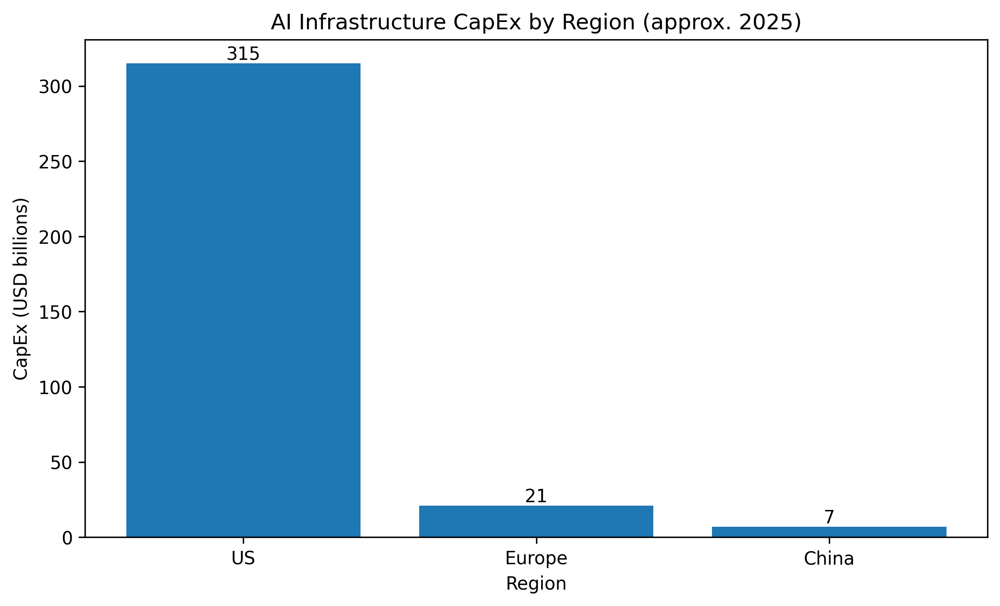

# AI Infrastructure CapEx by Region (approx. 2025)



This repo contains the dataset and code behind a simple comparison of **AI/data-center capital expenditure** across regions: **US, Europe, China**.  
It supports my LinkedIn post exploring how **AI infrastructure investment is distributed globally**.

## What’s inside
- `data/ai_capex_by_region.csv` — small dataset used for the chart.
- `data/ai_capex_by_region_sources.md` — detailed sources and caveats.
- `notebooks/capex_analysis.ipynb` — notebook to load and plot the data.
- `scripts/make_plot.py` — script to recreate the PNG in `outputs/`.
- `outputs/ai_capex_by_region_plot.png` — pre-rendered chart.

## Quickstart
```bash
# 1) Create and activate a virtual environment (optional)
python -m venv .venv
# Windows PowerShell
. .venv\Scripts\Activate.ps1
# macOS/Linux
source .venv/bin/activate

# 2) Install dependencies
pip install -r requirements.txt

# 3) Run the script to generate the chart
python scripts/make_plot.py
